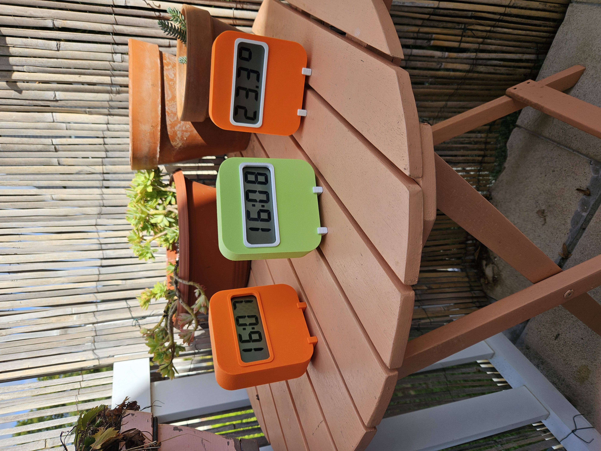
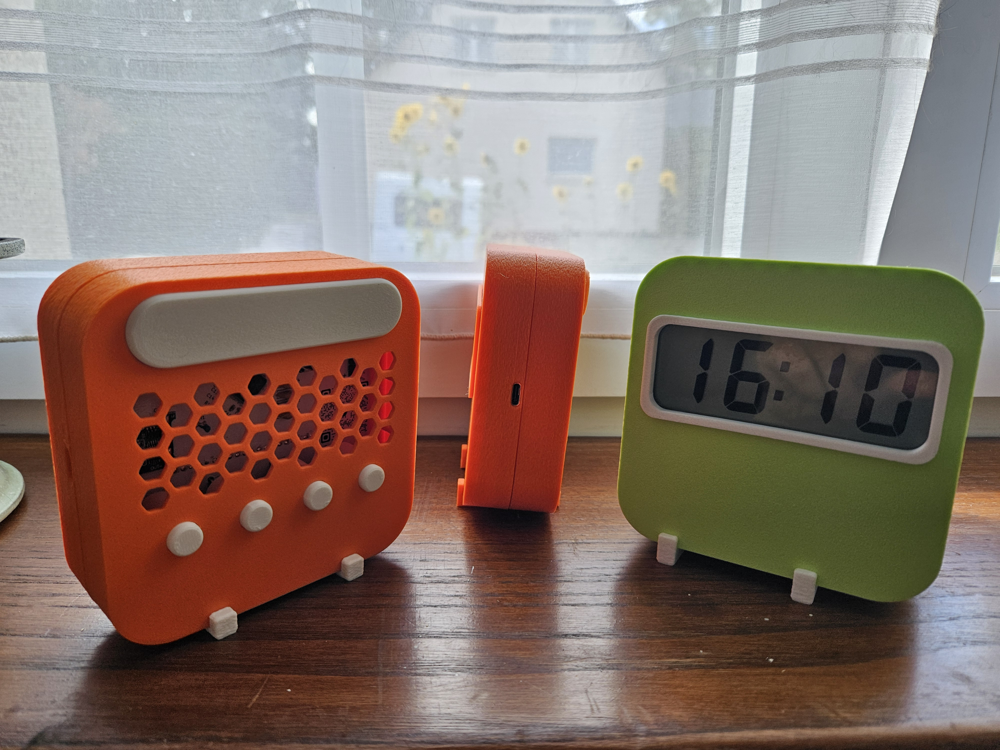

# ⏱️ LCD_CLOCK

Projet **open-source complet d'une horloge LCD basse consommation** basée sur un microcontrôleur **STM32U083RCT6**.

Ce dépôt regroupe l'ensemble des éléments nécessaires à la réalisation du projet :

- 📐 **Conception 3D** : boîtier et pièces mécaniques pour impression 3D.
- 🔌 **Électronique** : schéma, PCB, BOM, Gerbers et documentation PDF.
- 💻 **Firmware** : logiciel embarqué développé en C avec STM32CubeIDE / STM32CubeMX.
- 🖥️ **Affichage LCD** : pilotage d'un afficheur LCD 4 digits directement depuis le STM32.
- ⏰ **Gestion du temps** : utilisation du RTC et de l'oscillateur basse fréquence LSE.
- 🔋 **Gestion de l'énergie** : utilisation des périphériques basse consommation et des modes STOP2.
- 🌡️ **Mesures analogiques** : lecture de la température et de la tension batterie via l'ADC.
- 📖 **Documentation** : fichiers techniques et documents nécessaires à la fabrication et au développement.

---

## 🖼️ Aperçu du projet

| Horloge LCD |
| :---: |
|  |
|  |

---

## 📂 Structure du projet

```text
LCD_CLOCK/
│
├── 3D_design/                              # Conception mécanique
│   ├── LCD_Clock_back.stl                  # Partie arrière du boîtier
│   ├── LCD_Clock_button_lumiere.stl        # Bouton de commande de la lumière
│   ├── LCD_Clock_button.stl                # Bouton de commande
│   ├── LCD_Clock_capot.stl                 # Capot du boîtier
│   ├── LCD_Clock_dessous.stl               # Partie inférieure du boîtier
│   ├── LCD_Clock_face_avant.stl            # Face avant
│   ├── LCD_Clock.3mf                       # Projet / modèle 3D complet
│   └── LCD_Clock.step                      # Modèle CAO STEP
│
├── Electronics/                            # Conception électronique
│   ├── BOM/                                # Bill of Materials
│   ├── GERBER/                             # Fichiers de fabrication PCB
│   ├── KICAD/                              # Projet KiCad
│   └── PDF_version/                        # Documentation électronique PDF
│
├── pictures/                               # Photos du projet
│   ├── 20260919_160751.jpg
│   └── 20260919_161016.jpg
│
├── Program/                                # Firmware STM32
│   ├── .settings/                          # Configuration STM32CubeIDE
│   ├── Core/                               # Code applicatif et configuration
│   ├── Drivers/                            # Drivers et bibliothèques
│   ├── .cproject                           # Configuration du projet Eclipse
│   ├── .mxproject                          # Configuration STM32CubeMX
│   ├── .project                             # Projet STM32CubeIDE
│   ├── LCD_CLOCK Debug.launch              # Configuration de débogage
│   ├── LCD_CLOCK.ioc                       # Configuration STM32CubeMX
│   └── STM32U083RCTX_FLASH.ld              # Script d'édition des liens
│
├── README.md                               # Documentation principale
└── LICENSE                                 # Licence du projet

---

## ⚡ Caractéristiques techniques

* **Microcontrôleur** : STM32U083RCT6 (Ultra-low-power ARM Cortex-M0+).
* **Affichage** : LCD 4 digits piloté directement par le microcontrôleur.
* **Gestion du temps** : RTC avec oscillateur basse fréquence LSE.
* **Basse consommation** : Utilisation des périphériques RTC/LPTIM et du mode STOP2.
* **Mesures** : Température et tension batterie mesurées par l'ADC.
* **Conception PCB** : Développée sous **KiCad**, avec fichiers Gerber et BOM disponibles.
* **Alimentation** : Conçu pour fonctionner sur batterie.

---

## 🖨️ Impression 3D du boîtier

Les pièces sont situées dans le dossier `3D_design/`.

| Pièce | Format | Description |
| :--- | :--- | :--- |
| `LCD_Clock.3mf` | `.3mf` | Modèle 3D du boîtier |
| `LCD_Clock.step` | `.step` | Modèle CAO du boîtier |
| `LCD_Clock_capot.stl` | `.stl` | Capot du boîtier |
| `LCD_Clock_face_avant.stl` | `.stl` | Face avant |
| `LCD_Clock_back.stl` | `.stl` | Partie arrière |
| `LCD_Clock_dessous.stl` | `.stl` | Partie inférieure |
| `LCD_Clock_button.stl` | `.stl` | Bouton de commande |
| `LCD_Clock_button_lumiere.stl` | `.stl` | Bouton de commande de la lumière |

---

## 💻 Firmware & Développement

Le code source réside dans `Program/`.

### Prérequis

* [STM32CubeIDE](https://www.st.com/en/development-tools/stm32cubeide.html) (version récente)
* Sonde de programmation (ST-Link V2 / V3)

### Compilation et Flash

1. Ouvrez **STM32CubeIDE**.
2. Importez le projet à partir de `Program/`.
3. Si vous souhaitez modifier la configuration des périphériques, ouvrez le fichier `LCD_CLOCK.ioc`.
4. Compilez (`Build Project`) puis flashez le microcontrôleur via la configuration de débogage incluse (`LCD_CLOCK Debug.launch`).

---

## 🏭 Fabrication du PCB

Pour faire fabriquer la carte électronique :

1. Les fichiers prêts pour la fabrication se trouvent dans `Electronics/GERBER/`.
2. La liste des composants nécessaires est disponible dans `Electronics/BOM/`.
3. Les fichiers de conception sont disponibles dans `Electronics/KICAD/`.
4. Les schémas et documents sont disponibles dans `Electronics/PDF_version/`.

---

## 📖 Documentation

La documentation technique du projet est disponible dans les dossiers `Electronics/PDF_version/` et `Program/`.

---

## 📜 Licence

Ce projet est distribué sous licence open-source. Vous êtes libre de l'utiliser, le modifier et le distribuer.
